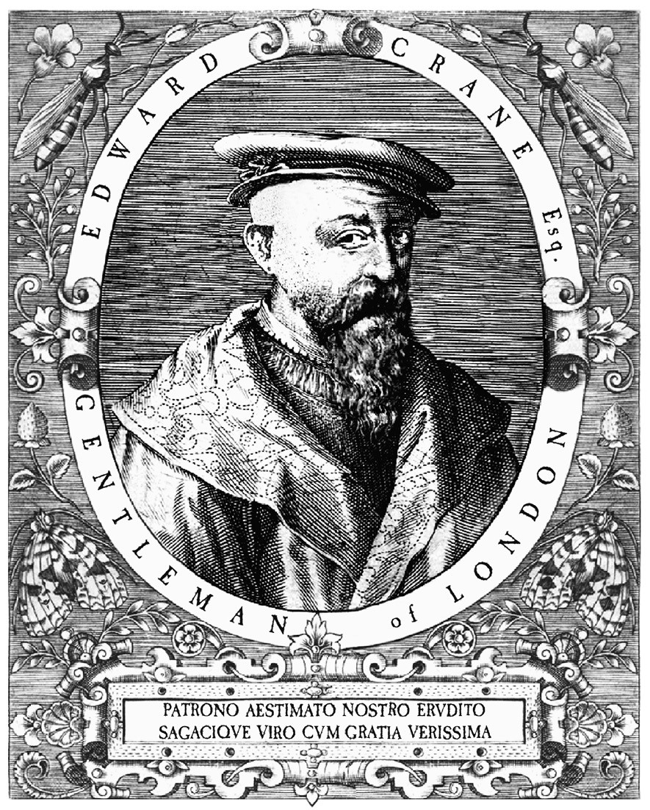

## 原书卷首画

我们也衷心感谢 Mistress Anita Cassidy、Mistress Julie Schmidt Bowen、Master Angus 与 Mistress Nita Gulliver，以及 Mistress Hazel W 和 Master Mark P。

------

## 关于作者

乔纳森·肯特是一位作家，也是一名记者。他曾担任政治记者、驻外通讯员和评论员，曾为英国广播公司（BBC）、路透社和《新闻周刊》等一些世界知名新闻机构担任记者，并为《卫报》和《每日电讯报》等媒体撰稿。2012 年，他为 BBC 广播四台制作的系列节目《我们每天的面包》（Our Daily Bread）广受好评。他目前正在制作一部纪录片，讲述在英国出生的华裔年轻人的经历。他在牛津大学基布尔学院（Keble College）攻读哲学和神学，目前居住在英国苏塞克斯（Sussex）地区的高地林野带[^1]（High Weald）。

------

## 献词

>献给 S，献给万事万物甚至万物之外的一切
>
>“如今常存的有信、望、爱这三样，
>
>其中最伟大的是蛋糕”
>
>——《圣经》哥林多前书13:13（改编版本）[^2]

---

[^1]: “高地林野带”为译者拟译，High Weald 尚无通行中文译名，直译为“高处的林地”。这是一处丘陵地形区，因其优雅的自然环境、大量的原始林地和保护得当的历史遗存，位列英国“杰出自然风景区”（Area of Outstanding Natural Beauty，但英格兰已经将这一牌子改名为“国家景观 National Landscape”。可以视为缩水版的国家公园，但其保护级别等同于国家公园）。本书未注明“原注”的注释均为译者注。

[^2]: 原文是“其中最伟大的是爱”。这是作者改编的版本。

