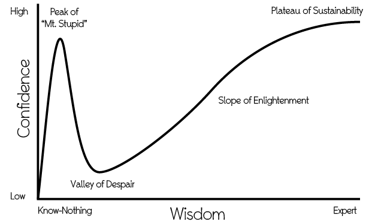

## Chapter Fifty-One: Communication

> Instead of offering empathy we often have a strong urge to give advice or reassurance and to explain our own position or feeling. Empathy, however, calls upon us to empty our mind and listen to others with our whole being.

> *— Marshall Rosenberg*

> I know it’s big and scary but just communicate. That is the single biggest tool that all of my relationships have had that have made them better, made them longer, made them more fulfilling. Tell them what you think. If things are going well, you have to communicate it. If things are going badly you really have to communicate it, really, a lot. It’s big and scary but it’s worth it. It pays dividends.

> *— Nathan*

If there are superpowers that most consensually non-monogamous people rely on, or try to develop, one of them is surely communication.

Our development of language as a means to communicate complex ideas distinguishes us from other animals, has allowed humans to collaborate with one another and has made us masters of our environment (albeit with mixed consequences). It’s generally accepted that we as a species developed big brains because of the need to process and manage both the complexities of group living and the sophisticated communication tools that facilitated it. Consensual non-monogamy certainly puts both of these core human abilities to the test.

Monogamy is complicated enough for most people. Consensual non-monogamy adds to that complexity. But that’s not all. As already pointed out, there’s no cultural blueprint yet for how to manage a consensual non-monogamous life, no set of unspoken rules that people absorb as they grow up, so none that we can take for granted to guide our dealings with other people. CNM is not a set menu, it’s not even a buffet, it’s an entire city full of restaurants. You get to choose what and who suits you. However, that also means it’s essential to make sure you’re on the same page as the people you’re dating. Everyone has wants and needs and expectations and, with CNM, there’s a very real possibility those could clash. Unless your telepathy is much better than mine you’ll need to communicate explicitly and verbally. It also means you’ll have to negotiate where people’s different wants, needs and expectations impinge on, or conflict with, one another.

There’s also the fact that, as Morgan puts it, poly culture typically encourages people to ‘do a lot more talking and exploration of the self.’

So communication (along with negotiation) is an essential skill in CNM. It’s one that almost all of us assume we already have. After all, we can talk, therefore we can communicate, right? You *would* have thought so, wouldn’t you? And yet people constantly miscommunicate, often with unfortunate consequences.

**The Dunning-Kruger Effect: As we begin to learn about something we scale Mt. Stupid, but some of us are quite content to stay up there just to enjoy the view.**

Though I’ve been a writer and journalist for most of my life, I’ve come to accept that not only will I never stop learning how to do what I do better, but also that, however hard I try, there’s a chance that what I’m trying to communicate will be misunderstood or misconstrued.

Lots of us need professional communication skills: journalists, salespeople, doctors and nurses and consultants; therapists and teachers; lawyers, politicians, military and business leaders. But does being a communicator mean we can manage a difficult discussion with a partner well? Not necessarily. There are many forms of communication. Just because we’ve mastered one doesn’t mean we’ve mastered them all. It’s a little like learning a language or a musical instrument. Once you’ve learned one it makes learning another easier, but it doesn’t confer mastery. Communicating in relationships is its own skill—one most of us are never taught. We just pick up what we know from our environment: parents, friends, movies and drama.

And though we tend to assume that people are people wherever they are, feelings and the way they’re expressed vary from culture to culture and from one age to another. Some are more comfortable with expressing emotion than others. For instance, the Inuit make a point of never getting angry with their children and teach them from a young age not to display anger or frustration.[^footnote-096]

As a result different people learn different rules and approaches about how to display emotion, what emotions are considered acceptable, and how one talks about them… or doesn’t. In a 2013 poll the Gallup survey organisation asked people around the world to record which of ten emotions (five ‘positive’, five ‘negative’) they had experienced the previous day. The Philippines scored the most (60% experienced the full range of emotions), Singapore scored the least (36%).[^footnote-095] Indeed, one element in Singapore’s school curriculum is rather unusual: ‘emotional and social learning.’

Vincent and Mia both, to some extent, typify that conflicted Singaporean relationship with feelings and their communication. He favours a high degree of disclosure but is not very forthcoming emotionally; she’s more private about what she might do but wants to discuss feelings.

> I guess communication is harder for me than it is for her. I come from a family that is more stoic. So my parents don’t really talk about things like emotions. They don’t express themselves very well. So, between me and her, she is normally the one who’s asking me about what happened, how do I feel, what’s going to happen next, that sort of thing.

For both of them communication has been a learning process. If you don’t get it by osmosis from your family and if it’s not something that is there in the ether around you, then what’s the answer? The alternative is conscious effort.

> What I have done consciously, over time, is to not over-react to everything he tells me. And that gives him a safe zone to talk freely with me as well. I think one of the reasons that he kept a lot of things to himself was that I tend to escalate things very quickly. For instance if he said he really liked the way her boobs looked, it would seem to become ‘Oh so you don’t like my boobs’ when he wasn’t actually saying that. So giving him that safe space to speak freely is what I think helped. You need to give the other person the freedom to express themselves.

Again, perhaps modern America has shown its influence. To an outsider it appears, at least superficially, to be a confessional culture. Guests open up on Oprah’s couch, celebrity relationships play out on a public stage, seeing a therapist is less a taboo than a conversation starter. It’s all very upfront.

Yet the ‘let it all hang out’ public confession would be alien and uncomfortable to people in many parts of the world. Even for Brits of a certain stripe it’s all pretty horrifying. Displays of emotion that are appropriate and encouraged in some cultures can be seen as inappropriate or shameful in others. Many of us are neither given the language nor the permission to discuss feelings. There’s no lit pathway.

Even people from the same country and of the same generation may differ in their styles of communication depending on their upbringing. Shyam and Rati are both ethnic Malayalee from India’s Malabar Coast and speak Malayalam and English. However while Shyam grew up in a quiet village deep in the countryside, Rati spent much of her childhood in India’s hectic business capital Mumbai. Their personalities and their styles of communication reflect that. Rati is passionate and fiery, Shyam’s nature far softer and more emollient (they also both make me laugh a lot). It means that Rati has had to adjust the way she talks to Shyam if she wants the two of them to engage.

> *Rati:* There are different ways to approach the communication, but, I think you have to really know when to back away when you’re angry or even jealous or even when you tell the other person ‘I’m hurt’ if you don’t say it the right way, in a certain way it’s really going to damage the relationship. And it gets even more complex when you have more than one partner.

> *Shyam:* I think, one most important thing is respect. Initially, for me, one of the problems was that she grew up in Mumbai. I pretty much grew up in a village and even here I don’t use, like, even ‘fuck you’. I don’t use that kind of words in a normal context even to a friend or in a relationship and I get angry.

> *Rati:* I know he’s very sensitive about words, but so far I’ve only been allowed to call him *pundai*, which is a Tamil word for pussy. And I use it in a funny sort of way. But if I’m angry, and even if I see like today we actually got into an argument and I said, ‘You should be fucking grateful.’ And just because I said ‘fucking’ it was quite bad.

It’s interesting, isn’t it, how two people who love each other can have very different registers when it comes to communicating. For instance, some of us find swearing cathartic. It can be a way to relieve pain or stress or to give something emphasis. But for a person being sworn at, especially if they’re not given to swearing, it can feel like being assaulted.

A lot of the emotion that we can pour into our communications may reflect how we feel, but it can easily become an obstacle. Confronted by someone in a charged situation we focus on expressing our feelings rather than securing what we need.

For instance, if we feel powerless we might puff ourselves up through anger, or we might try to bully the other person.  If we’re hurt we sometimes focus on getting the other person to feel our pain not by allowing them to empathise but by reflecting the pain back onto them in the form of verbal barbs and accusations.

Sometimes we ensure that we’re heard at the expense of our being listened to.

For this reason, this chapter is going to focus on communication that isn’t just aimed at everyone being heard, it’s going to be very much about results. In a relationship, that typically means ensuring that we’re understood as well as that we understand our partners. At the heart of that it’s about ensuring that our needs and those of everyone else involved are met.

### Nonviolent Communication

I first met Chris when we were students together in the 1980s. Even then, though he’s very modest about it, he had great powers of empathy. He was an excellent listener and one sensed he drew upon an inner well of compassion. Some ten years later, having been a Buddhist since his younger days, he decided to be ordained as a Dharmachari monk. He took the name Shantigarbha, which translates as ‘seed of peace,’ and he has become an authority on Nonviolent Communication (NVC).

Nonviolent Communication emerged as a peacebuilding tool in the 1960s. The originator of the idea, the American psychologist Marshall Rosenberg, saw in conflict not competing needs but competing strategies to obtain those needs. He felt that human needs themselves were not inimical to one another.

The qualities that NVC encourages are **empathy**, **honesty**, **compassion** and **collaboration**. So how to achieve this? Shantigarbha thinks we concentrate too much on getting what we want rather than building the relationships that will turn conflict into a positive process—and thereby get us the best result.

> It means focusing on the relationship, the quality of connection, rather than the outcome, focusing on the quality of connection that will lead to everybody’s needs being addressed, everybody’s needs being valued.

In Shantigarbha’s book *‘I’ll Meet You There’,*[^footnote-094] a book I can wholeheartedly recommend, he opens with an account of a mediation session in Nigeria where two communities, one Christian, one Muslim, had been in conflict over the allocation of stalls in a marketplace. A number of people had been killed, and both sides initially saw the attempt to bring them together for talks as an opportunity to air grievances. It was wholly understandable. Everybody had lost someone or knew someone who had lost someone.

What the mediators strove to do was to get both sides to focus on what they needed, not on recrimination. Even so, when one side was finally encouraged to stop blaming the other for long enough to say what it was they were after, primarily security, their foes could only respond with more expressions of anger and pain. It took effort by the mediators to finally get each side to repeat what the other needed, to show they had listened.

It was powerful stuff. You may recognize this practice of repeating back what the other party said, to make it clear that you heard them correctly, as the NVC technique of *active listening.*

We all have needs. When we realise that others have them too and we acknowledge that, we can start to see what *they* need alongside what *we* need.

Shantigarbha is full of stories. He offered me a choice and I chose this one about an attempt to bring together a group of Israelis and a group of Palestinians, people both isolated from one another and at the same time bound together by one of the most protracted, intractable and emotive conflicts of our time.

I chose this partly because it reminded me of Shelly, the Israeli-Jewish academic, and one of her partners who is of Palestinian origin—two people showing in their own small way that when we see our needs as indivisible, not irreconcilable, then peace and love can follow.

> We did a nine-day reconciliation event for about a hundred Israelis and Palestinians. I think it was 2011. And it was a very scary business. I think everybody who came was scared. I’d like to pay tribute to them. The Israelis who came were scared of being ostracised by their families, and the Palestinians who came were afraid of being stopped on the way and also being ostracised by their families and their social networks. So people came because they realised that the political process was not going to result in anything that they were looking for in terms of reconciliation or even just understanding each other in a little more thorough-going way.

> So, they had zero hope in the political process. So that’s pretty much what united them. And then they realised that actually they need to go and talk to each other and listen to each other. So we ran an event. We worked very hard helping them to listen to each other. When things broke down, when they got angry or upset, the walls came up, then we paused. We went into smaller groups to listen to them more, listen to people individually. And then we did community activities like dancing and singing and eating. And then we went back to the listening; supporting them to listen to each other.

> And there’s one Israeli woman who was in a communication exercise with a Palestinian man in a small group. They were listening to each other. And I think for the first time she was able to hear the pain of the Palestinian man without hearing it automatically as blame of her and of every person of Jewish origin. And it was very, very moving for her. So she was able to cry with him to just acknowledge his pain and his suffering, his upset. And at the end of the session she went up and hugged him, which is very unusual for a middle-aged Jewish woman to do in a semi-public context. So, that was a moment of amazing grace you could say.

> In those kinds of situations connection is a very scarce commodity, so it becomes very precious. Whatever we can contribute to connection, towards mutual understanding, that becomes very, very precious. It helps me to understand and realise just how precious connection and understanding are for me in my life.

Many principles of Nonviolent Communication have made it into mainstream therapy and counselling in the half century since Marshall Rosenberg first set out his stall. They haven’t changed much. It’s all about establishing and maintaining a connection through empathy and working together with compassion towards a mutually beneficial conclusion.

Does that mean everyone who offers NVC advice is great at this? No. *Knowing* how to communicate better and *applying* the principles are two different things, particularly when we’re upset or at a low point. But it’s a really useful reference point. Even putting a few of these thoughts into practice should be helpful.

One caveat—these suggestions are intended to help you communicate more productively with someone with whom you are safe both physically and emotionally. Better communication can help, but like almost anything it can be used as a weapon and a tool of abuse. As we’ll see in the next chapter, rather than think about radical honesty I suggest that we think in terms of radical vulnerability, i.e. choosing to make oneself (not someone else) vulnerable. If someone else is seeking to make *you* vulnerable and not themselves, there’s something amiss. ‘You will do it this way’ rather than ‘I will do it this way’ is a warning sign.

As previously mentioned a thought that I really struggle with is the oft-repeated mantra that ‘no one can *make* you feel anything’. As we’ll see below, framing things in terms of ‘you make me feel *x*’ is unhelpful in reaching a resolution because it assumes intent—that someone else is intending that an action produce a feeling. However there are instances where that is exactly what is happening—gaslighting, coercive control and other behaviours are all designed to elicit a particular set of reactions.

In such situations, if things are so highly charged that you are unsure of your safety or wellbeing, if your instincts or your friends tell you that you are being abused, then you shouldn’t put yourself at risk. That is not a situation in which honest, open-hearted communication can take place. If in doubt, make sure you have support and make your safety paramount.

### A bleedin’ ginormous list of tips for better communication

Not all of these are canon NVC, but all should be worth considering.

***Prepare****.*

Get yourself ready. If you ready yourself for battle you’ll be ready for a battle. If you ready yourself to connect you’ll be in the right frame of mind to make a connection.

It’s quite common to play through scenarios in one’s mind as a form of preparation, but that can become a self-fulfilling prophesy. If you’re concerned about the possibility of conflict, then rather than psyching yourself up for a fight it’s surely better to prepare by focusing on being calm. Calm works for most things. If you need help, seek help. Shantigarbha:

> Before you have that conversation either do some serious self-connection or ask for some support, listening support, or empathy. Ask a friend to listen to you, so you get a chance to get things off your chest in a safe, compassionate way before you go into the difficult conversation.

***Make time****.*

It’s not easy to prepare for something if you didn’t know it was coming. And marshalling your thoughts when you’ve been caught on the hop is often difficult. You haven’t had a chance to think through what you might like to say.

Anita’s idea of setting aside time regularly is an excellent one.

> I’ve tried to initiate a weekly relationship-check-in kind of setup where we have a set day a week where we would touch base on the phone if we aren’t seeing each other, because we only see each other once a week. But he’s fairly averse to that because he thinks it’s too formal, but I think it would create a space by which we could say this is one point in the week where everyone’s safe to talk.

It means you can communicate without it being a big ‘Hey, we need to have a deep and meaningful conversation’ moment. That can lead to anxiety. A regular check-in can also help to ensure that communication comes slow and steady rather than a whole shedload of pent-up feelings all spilling out at once.

***Touch****.*

Within a relationship, communication can be a means of forging and deepening a connection. Sometimes physically connecting, holding a hand or rubbing someone’s foot, changes the dynamic of the conversation. Affectionate touch can be very soothing. More than that, says Shantigarbha, it’s a subtle but powerful echo of the emotional link between you.

> What I would suggest is find a way to assure your partner that you wish to stay connected, maybe even make an agreement about how you do that. For [my partner] and I, what that means is usually we keep some physical contact when we’re having a difficult conversation; we have a hand or a foot and the hand or the foot says, ‘I want to keep this connection.’ It’s okay that we disagree with each other. It’s okay that we have different ideas, that we were different people. That’s okay. We want to keep the connection.

If you can find a way to both touch and be able to look at one another while you talk, maintaining eye contact and a physical link, you may find it leads to more calm and positive discussions.

***Empathise***.

This is really hard for many of us, particularly when we’re upset. If we’re anxious or angry, insecure or afraid, it’s very easy to be so overwhelmed by our own feelings that it’s hard to have the space to listen to someone else’s. But this is what we try to do when we empathise. It’s about sensing what it’s like for another person to be standing in their shoes. That’s why picking a time when we’re not overwhelmed is a good idea.

Empathy is at the heart of Nonviolent Communication. It’s not trying to stage a courtroom battle between accuser and defendant, or a debate between two sides of a legislature. We’re trying to build understanding, to find common ground, to resolve issues together. Empathy is a way of moving a discussion from confrontation to collaboration and it often starts when you…

***Listen****.*

Confession: I have a bad habit, especially when interviewing people: I react to something they say before they’ve finished speaking. Sometimes that means butting in to ask a supplementary question, sometimes it’s formulating that next question in my mind as they speak. The trouble is, as soon as I do that I stop listening.

If you really want to listen, then really engage with their words. Don’t get lost in them and disappear off into your imagination while they’re talking. As Shantigarbha says, be present to the person in front of you.

> When I want to just listen, be fully present with the other person, to give my full attention to the other person, if something comes up for me during that time, then I would just say to myself, okay, Shantigarbha, just give yourself a little bit of space later on, maybe later today for that. Come back to it when you’re ready. For the time being I want to give my attention to the other person.

It’s worth noting that for people who are used to communication as a form of conflict, someone listening quietly to them can feel remote or disengaged. You might take note of the section further below, ‘Repeat back, clarify.’

***Stupid things we do when we think we’re listening and empathising****.*

We offer advice. We try to fix someone/something. We offer explanations and excuses, correct their story, show pity, offer consolations, tell a story about us to show them we understand (guilty… so totally guilty), tell people what to feel/not feel, sympathise (it’s not the same as empathy and it’s often unhelpful); we collude, investigate, interrogate, evaluate, criticise, educate, and indulge in one-upmanship (‘Oh, you think you’ve got it bad, you should have seen what I had….’)

Don’t do this shit. (Also note to self: Don’t do this shit). As Marshall Rosenberg said, empty your mind and listen (and shut the fuck up). List courtesy of Shantigarbha’s lovely book *I’ll Meet You There*.

***Repeat back, clarify****.*

It’s one thing listening well but it’s quite another assuring someone that they’ve actually been heard. Being heard is important. How much of the conflict in our world stems from people feeling unheard and powerless to change that? How much violence is an attempt to gain attention?

*Repeating back what someone has said to you is a good way to show that you’ve listened.* It can also be very effective if you repeat what they’ve said in your own words and use that paraphrase as an opportunity to clarify.

If you do it with empathy and compassion it is also an opportunity to refocus the conversation on needs and substantive issues. For example:

> *A:*  You never do the shopping. You never seem to do your share of the housework. It’s always me cleaning up after you.

> *B:*  I’m hearing that you feel unsupported, that you need more help with the chores, that you are feeling unappreciated for your work in keeping the place together and want everybody to pull their weight. Have I understood right?

That brief exchange has done several jobs—it’s an acknowledgement, it shows understanding and engagement, it changes the tone from accusatory to being practical and needs-focused, and it moves the conversation towards a resolution. Demonstrating that you’ve listened to and understood what’s being said does not require you to accept it as objective truth, even if it is the other person’s truth.

***Ask!***

Asking questions is another form of active engagement. Again empathy and compassion are key here. It’s not an interrogation. It’s not an opportunity to catch someone out, to trip them up or to make them feel stupid. The point of asking questions, says Shantigarbha, is to deepen your understanding of the other person.

> There’s a kind of natural curiosity that comes up about other people and about what’s going on for them. So we look for that natural curiosity, and we’re wanting to connect with specific things about the other person. Like, what are they feeling at the moment and what do they need?

Asking questions in a genuine spirit of enquiry shows that you’re interested. Don’t forget to listen though. That’s the point, yes?

***Weigh your words!***

Lordy, words really do have weight. Many are loaded and contain implicit judgements. This will be confronting for other people who don’t agree with those judgements.

Think about the way people use words to accuse or excuse. Think about the euphemisms we’ve developed to reduce our own feelings of guilt for what we’ve done. We don’t fire people, we ‘let them go’ as if we were returning otters to the wild. The military doesn’t inadvertently kill women and children by shooting into buildings and blowing things up; ‘operations’ result in ‘collateral damage’. If you phrase it properly it was no one’s responsibility. Don’t let your words accuse, but do let them take responsibility.

***Avoid sweeping, absolute statements.***

Lots of words increase the risk of conflict because they’re absolute: always, never, everything, nothing, everyone, no one. If you say ‘You never help’ then it may feel unjust to the other person and leads them to think of an instance when they did help, even if they didn’t help much. It derails the discussion because the ‘never’ statement is, taken literally, not true. If you keep things more relative and less absolute it is less confrontational and almost certainly closer to the truth.

Indeed, in any form of communication, I’d counsel people against using ‘always’ and ‘never’. It makes you a hostage to fortune or simply to facts.

***I, not You.***

If you need a simple barometer it’s the ratio of *I* and *you* appearing in your communication. If you’re using *I* a lot you’re probably doing okay at explaining your side. If it’s predominantly *you* then you might want to take a step back.

Let’s talk about using ‘I statements’.

When we’re talking about I in this context, we can truthfully explore areas like feelings. I can say with factual confidence ‘I am feeling upset’. However if I say ‘You are being mean’ that’s firstly much more adversarial, and secondly it may not be true. It’s possible that the person felt they said such a thing honestly in an attempt to clarify, not as an attempt to hurt. ‘You are being mean’ is not just accusatory, it also makes presumptions about intent. Saying ‘You’re trying to stop me seeing *x* because you’re jealous’ makes assumptions about both intent and motive.

Couching things in terms of ‘I feel…’ changes the dynamic. Difficult things can still be said, but ‘I statements’ can acknowledge that feelings have arisen out of the perception of someone else’s actions. Shantigarbha:

> ‘You make me feel such and such’—that’s an interpretation or evaluation. It implies that the other person has the power to make you feel certain things. To regain a sense of empowerment (and self-responsibility) you could try saying, ‘When I notice how much time you spend with this other person I feel jealous. I feel hurt and sad because I really want to be valued, I want to know that I matter. I want to know that I belong’.

***Evaluations and opinions vs. facts and feelings.***

Try to stick with the more concrete. You can explain how you feel about things. You can link feelings to events; ‘When you did *x*, I felt *y.*’ *‘*I wanted you to help with cleaning out the garage. In the end I did it all on my own.’

Try to avoid speculating about the motives of the other or make statements about things that you cannot know - how someone else felt, or why they did something. As Shantigarbha points out, people can easily be wounded by the way others interpret their actions, especially when talking about feelings.

> It certainly helps to reduce the number of interpretations of other people’s behaviour, generally speaking, because when you introduce interpretations or evaluations, they tend to be heard as blame or criticism. So, an evaluation might be, ‘You make me feel worthless’. It’s an evaluation, ascribing responsibility to the other person for what the other person has done to me. Interpretations and evaluations tend to trigger the other person.

So, better in this instance would be ‘When you say x, I feel that I’m worthless’.

***Be clear. Be specific. Deal with the issue in hand.***

Don’t try to solve everything at once. Know what it is that you need to discuss and stick to that. Try not to derail something that someone else needs to talk about by talking about something different unless it’s directly related.

‘I’m worried about money and I feel all the responsibility is falling on my shoulders to support us financially,’ is one topic.

‘I contribute in other ways; I look after the house and kids while you’re working,’ is an on-topic response. ‘Well you spend plenty of it on Tom, so why should I care?’ is off-topic.

Try to keep your focus on an issue, not on the person.

***Identify needs.***

This is where you should be headed. ‘I’m unhappy about *x*’ is a statement but it doesn’t offer a path to a resolution. As Shantigarbha says, it helps us to explore behind and underneath the mass of feelings that sometimes overwhelm us and ask what it is that we are actually after.

> I support people to connect with the feelings and needs that they’re in touch with. So, if you’re feeling jealous and needing love or attention or being valued, strip it back to the feelings and the needs and take out interpretations or evaluations.

‘I’m worried about you and Anna. I’m left wondering how much you care about me. I need to feel that I’m important to you. I would like us to spend more quality time together doing things that we both enjoy. Can we look at our diaries and find three dates in the next two weeks?’ That identifies an issue and its impact, and it suggests a concrete direction to go in.

***Share.***

Without overloading someone, give them background and other information that allows them to understand where you’re coming from:

‘This is difficult for me because of what happened when I was at college,’ followed by an explanation, if necessary, of what happened.

***Chill.***

If things get heated take time to let them calm down. There’s rarely a deadline to resolving the kind of issues that crop up in relationships. Even if there is a deadline the issues are not going to get sorted out better or more quickly for trying to do so while upset, anxious, agitated or angry. As Rati says:

> One thing I’ve learned: If you’re angry or hurt… take a break. And it could mean a few minutes, it could mean a few hours. But I think that really helps when you back away, you know, like you can be really pissed.

One piece of advice that is often shared in the poly community is that after an argument, it takes a good 20 to 30 minutes for the cortisol and other stress hormones to clear out of your system, so attempts at reconciliation before that has happened could explode in your face. Say that you need some time alone, and perhaps even set a timer.

Just as people use safewords in kink and BDSM, safewords have a role in communication too. Agreeing on safewords beforehand—they could be the same or different than those you use in other situations—allows people to signal that they’ve become uncomfortable and are worried about the way the conversation is developing.

Again, communication is almost never better for taking place when people are feeling uneasy. You’re looking for empathy, compassion and cooperation. Allowing someone to flag their discomfort gives everyone a chance to pause and to refocus on working together to achieve a positive outcome for everyone.

***Own your stuff.***

This will come as a shock to some of you who have read thus far… but I’m not perfect. Sorry to shatter your illusions but I get stuff wrong. Sadly this happens far more often than I’d like. Here’s my guess (and yes, I know this is speculation, and speculation should be avoided, but it’s a hunch based on thousands of years of humans getting stuff wrong, so...) you probably do too.

That’s okay. To err is human and all that. However the first step towards putting something right is accepting that you got something wrong.

Politicians and business leaders struggle with this. They don’t like admitting they screwed up. Trouble is, it slows down the process of sorting stuff out.

A good place to start is with ‘sorry’. However it’s best to be clear about what you are sorry for. You are apologising for, and owning, your error. You are not apologising for someone else’s actions or for their feelings.

‘I’m sorry that you didn’t understand and couldn’t play your part,’ is not an apology. It’s passive aggression.

‘I’m sorry that you feel that way,’ is not an apology. It’s just crap. And pathetic. Translated into English it means ‘I’m frustrated that you’re upset. Frankly I couldn’t give a damn but I want to make some sort of noise so you’ll go away.’ PR people love this stuff. Call them on it. It’s not an apology, okay?

‘I’m sorry I screwed up. I want to try to put it right,’ *is* an apology. See, got there in the end. Gary Chapman of the five love languages also suggests five elements that make apologies work: expressing regret, accepting responsibility, making restitution, genuinely repenting, and requesting forgiveness. It’s a useful checklist.

Anita did things in her previous relationship that she heartily regrets. The fact that she’s faced up to her mistakes has given her the chance to grow, the ability to help others grow through sharing her experience, and the possibility of self-compassion.

> For me a big part of my growth in this space is about modelling best practice and essentially being someone that has made mistakes but knows the pain caused by those, both to oneself and others… and who does the best one can do in as many situations as possible, whilst giving myself plenty of leeway to still fuck up occasionally.

Accept imperfection. Deal with the important things. Accept what you can accept.

Conflict is a part of human existence. However, too much of it makes life unbearable.

As for me? After getting into far too many arguments with far too many people, I decided ‘Enough! From here on I’m going to pick my fights.’

Yes it’s annoying getting ripped off for a fiver but, as someone put it, some things you can simply accept as the price of peace of mind. If you’re broke and hungry a fiver is a lot, so deciding at what point one can afford peace of mind is a choice we each make in each situation. As Debbie says, it’s about deciding what is important enough that you need to deal with it, and letting go of the rest.

> Don’t sweat the small stuff! I mean that’s a very clichéd thing, but I found that if something seems like it might be bothering me, if I step back and not necessarily sleep on it but like sit on it for a tiny bit…. The smaller things, a lot of times those don’t really matter and they’re not anything that’s going to build up into anything big. But at the same time just remember like hey, to communicate is the biggest thing I’ve noticed that counts in any relationship. Just make sure that you’re on the same page as the other person that you’re around or with.

***Respect difficulty. Respect difference.***

How we feel about outcomes is often a reflection of our expectations. Someone who’d hoped to be paid £7,000 would probably be disappointed with £5,000, but someone who’d hoped to be paid £3,000 would doubtless be delighted.

When we’re communicating with someone else it helps to manage expectations. As someone once said, ‘Life is hard. Once you accept that, life becomes much easier.’ The same can be said for many things, not least the process of trying to connect with someone else and solve problems together.

Don’t pin your hopes on breakthroughs. Don’t bank on someone else changing radically. In particular, don’t expect someone to change radically the way you’d like them to change.

Where it’s possible, accept difference. It is there to be celebrated. Our diversity really is a strength. It’s nature’s way of giving humanity a fighting chance of making it into the next millennium, and it’s way more interesting than everyone being the same. After all, the Borg in Star Trek are many things—but they’re not known for being fun at parties.

And, as has been said, accept the possibility that a relationship may indeed end. Sometimes differences are insuperable and those involved can’t live with them.

Once you’ve committed to collaboration, are resolved to use empathy and compassion, and have let go of attachments to particular outcomes, you’re prepared for most things. Take it from Nathan. It can be scary but it’s worth it.

> Communication is really difficult and it’s really necessary.  Your communication style will grow as the other person’s will. They’ll come to understand you better. But start. Fear makes the monster bigger. Don’t let fear win; start! I say this, but it’s way easier to say than do. There are many times in the past I’ve caught myself not starting because of fear.

***The kitchen sink.***

Might as well. I’ve thrown almost everything else in. So here it is: If it’s your turn to do the dishes, perhaps you might want to wash and dry them before you talk.  :)

I want to end this section with another story from Shantigarbha, this one more personal. Perhaps we might reflect on it in the light of the above. How could this couple communicate better? How would you do it differently? Is there anything here you might bring to your own discussions?

> One of the first couple-mediations that I did was in London. A young professional couple, a man and a woman, came in. They were probably around thirty. Initially they were quite polite with each other and then they started talking about times when they went out to restaurants. And then the woman said, “You’re just sitting there on your phone, you don’t pay any attention to me”. And then the key phrase, “You never listen to me”. She said, “I tell you about my work, I tell you about my day. You never listen to me!” So that was like the catch phrase. Of course the guy heard this and didn’t want to know, didn’t want to be involved.

> So I encouraged him to listen to her, but he found it difficult and said, ‘Look, I’m new to this. I don’t understand.’ So, I said, well perhaps you could just acknowledge that she wants your full attention. Just to say to your wife, ‘Look, I can see it was painful for you because you want my full attention right now.’ And so he said this, and she looked relieved for a moment, but then he added something else, and that threw the whole thing again. She went back to, ‘You never listen to me and you always try and turn this around and you always try to make it my fault.’

> Then I switched tack and said to her, ‘How about if he tells you three things that he enjoys about you? And she said, “You know, maybe that might work.” So then he started, and it was quite difficult, but he found three things that he appreciated about her. I think he appreciated her dress sense [among other things]. Anyway, he started warming up with these three things. And then after a while she kind of relaxed and could receive him again. She could begin to see him as her partner again, as the person she loved.

> That’s a very sweet memory of one of the first mediations I ever did.

### What We Can All Learn

Communication isn’t a non-monogamous thing any more than it’s a monogamous thing. It’s just a human thing. However, the fact that it’s so central to the way that many people practice CNM reflects the fact in the CMN world, fewer assumptions can be made about many things and thus more needs to be discussed.

But that doesn’t mean that monogamous relationships don’t benefit from better communication. Talking more won’t make you less monogamous. It’s not a threat.

It’s when there are things that we feel we can’t discuss that a relationship can become difficult. This is why deceiving a partner, whether through lying or cheating, can be so corrosive. It results in significant things that can’t be discussed, and these become a barrier to intimacy. The feeling that we can’t wholly open our hearts can lead us to pull back further, rather than talk deeply and risk stepping on one of those lie-mines that we’ve laid for ourselves because we’ve forgotten where it is.

A lot of non-communication is grounded in fear: fear of hurting someone, of being hurt, of hearing what one doesn’t wish to hear. There is no easy answer to that, however. It requires bravery but if bravery was easy it wouldn’t really be bravery[^footnote-093] would it? But if you believe that it’s better to face reality and deal with it than live a half-life that you’ll never be able to fully trust is true, then communication is a route to the real.

And, above all, better communication builds deeper intimacy. Life can be lonely enough as it is. Creating safe environments in which to talk with empathy and compassion is a powerful response to those feelings of distance, loneliness and isolation.

---

[^footnote-096]: ‘How Inuit Parents Teach Kids To Control Their Anger’, National Public Radio (US), 13 Mar 2019. https://www.npr.org/sections/goatsandsoda/2019/03/13/685533353/a-playful-way-to-teach-kids-to-control-their-anger
[^footnote-095]: The US scored 54%, the UK 49%, Lithuania 37%, Russia 38%, South Korea 42%, India 44%, China 46%, Nigeria 50%, France 52%, Spain 53%, Bahrain 56%. Most Asian countries score low, as does Eastern Europe, most Arab and Latin American counties score higher, while Africa and Western Europe show a broad spread.
[^footnote-094]: Shantigarbha, *I’ll Meet You There: a practical guide to empathy, mindfulness and communication,* Windhorse Publications, Cambridge UK, 2018. ISBN 978-1-911407-41-6
[^footnote-093]: Sometimes bravery looks a lot like stupidity. There *is* a difference. Bravery involves understanding the risks and the possibility of loss and taking a decision to act regardless. Stupidity is based on neither knowing nor caring to know and blundering in all the same. Brave generally wins out over stupid. Generally.
